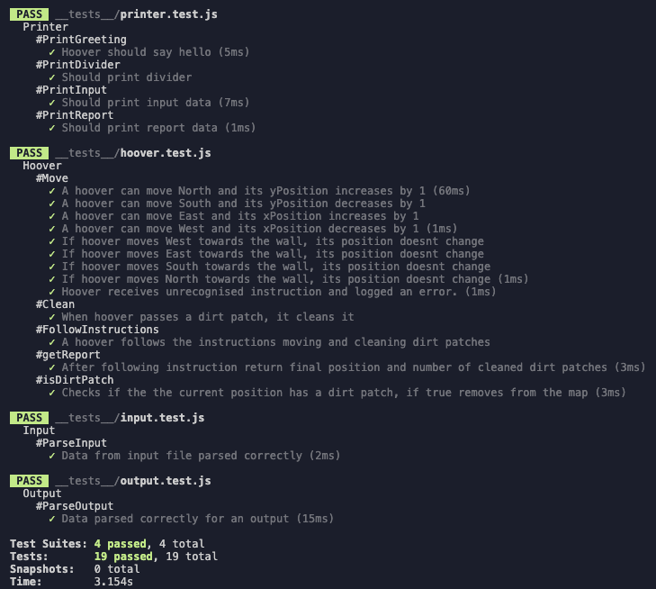
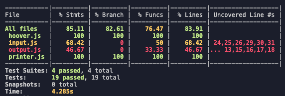
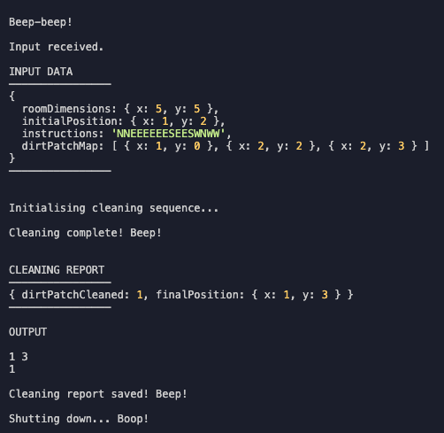

# 🤖 🧹 Robotic Hoover

A program that navigates an imaginary robotic hoover through an imaginary room based on imaginary instructions.

<p align="center">
		 
[Specification](#specifications) | [How to Install](#how-to-install) | [How to Use](#how-to-use) | [Approach](#approach) | [Tests](#tests) | [Demo](#demo) | [Detailed Instructions](#detailed-instructions) |
</p>

## Specifications

#### Input:

- The room dimensions (X,Y)
- The initial hoover position (X,Y).
- Coordinates of dirt patches (X,Y).
- Driving instructions.
- Input should be read from a text file residing in the same folder as the app file
- Retrieve the input file that is hosted remotely (not implemented).

Example input (input.txt):

```
5 5
1 2
1 0
2 2
2 3
NNESEESWNWW
```

#### Output:

- The final hoover position (X,Y).
- The number of patches of dirt the hoover cleaned up.
- The programme output is printed to the standard output of the terminal
- Output should be written to a text file so it can automatically be checked

Example output:

```
1 3
1
```

<br><br>

## How to Install

```
git clone git@github.com:ollyholly/robotic-hoover-tech-test.git
cd robotic-hoover-tech-test
npm install
```

<br><br>

## How to Use

In command line run `npm start`

<br><br>

## Approach

### Planning

- Start with hardcoded input
- Initialise a hoover with room dimensions, starting position, a dirt patch map & driving instructions.
- Hoover can move NWSE and its position changes
- Hoover moves based on the provided driving instructions
- When hoover reaches a wall and moves towards it, hoover position doesn't change
- When hoover passes a dirt patch, dirt count increases, dirt patch location is removed from the map
- When hoover finishes its program it returns the last position and the dirt count
- Read input from a local input.txt file
- Parse input and set up the hoover
- Read input from a remote file
- Write output to a text file
- Improve user interface

### Modules

- App – uses other modules to run cleaning protocol
- Hoover – handles hoover position, movement & clean-up
- Input - reads the input file, parses input, writes into the output file
- Output - parses data for the output, writes into the output file
- Printer – provides enjoyable user experience
- Dirt patches (considered, not implemented) – handles map of dirt patches and cleaned spaces

### Edge cases and errors (🚧 not implemented)

- When instructed to move towards the wall, hoover stays in place ✅
- Unrecognizable cleaning instructions ✅
- Given coordinates are not integers 🚧
- Given coordinates are outside of the map 🚧
- Room dimensions can not be less than 1 🚧

### Under construction 🚧

- retrieve input from remote file + test
- tests for reading input
- tests for writing output
- tests for App module
  – some edge cases (see above)

<br><br>

## Tests

To run tests type

```
npm test
```

To view test coverage run

```
npx jest --coverage
```

<br><br>


<br><br>

## Demo



<br><br>

## Detailed instructions

A program that navigates an imaginary robotic hoover (much like a [Roomba](https://en.wikipedia.org/wiki/Roomba)) through an equally imaginary room based on:

- Room dimensions as X and Y coordinates, identifying the top right corner of the room rectangle. This room is divided up in a grid based on these dimensions; a room that has dimensions X: 5 and Y: 5 has 5 columns and 5 rows, so 25 possible hoover positions. The bottom left corner is the point of origin for our coordinate system, so as the room contains all coordinates its bottom left corner is defined by X: 0 and Y: 0.

- Locations of patches of dirt, also defined by X and Y coordinates identifying the bottom left corner of those grid positions.

- An initial hoover position (X and Y coordinates like patches of dirt)

- Driving instructions (as cardinal directions) where e.g. N and E mean "go north" and "go east" respectively).

The room will be rectangular, has no obstacles (except the room walls), no doors and all locations in the room will be clean (hoovering has no effect) except for the locations of the patches of dirt presented in the program input.

Placing the hoover on a patch of dirt ("hoovering") removes the patch of dirt so that patch is then clean for the remainder of the program run. The hoover is always on - there is no need to enable it. Driving into a wall has no effect (the robot skids in place).

### Goal

The goal of the program is to take the room dimensions, the locations of the dirt patches, the hoover location and the driving instructions as input and to then output the following:

- The final hoover position (X, Y)

- The number of patches of dirt the robot cleaned up

### Input

Program input is received in a file with the format described here. The file is named `input.txt` and resides in the same directory as the [executable program/web page].

Example:

```
5 5
1 2
1 0
2 2
2 3
NNESEESWNWW
```

- the first line holds the room dimensions (X Y), separated by a single space (all coordinates will be presented in this format)

- the second line holds the hoover position

- subsequent lines contain the zero or more positions of patches of dirt (one per line)

- the next line then always contains the driving instructions (at least one)

### Output

The program output is printed to [AMEND TO SPECIFY: the standard output (STDOUT) of the terminal (or equivalent in the browser, console.log()]

- The first line of the program output displays the X and Y coordinates marking the position of the hoover after processing all commands.

- The second line of the program output displays the number of patches of dirt the robot cleaned up.

Example (matching the input above):

```
1 3
1
```

**Deliverable**: Output text file so it can automatically checked
